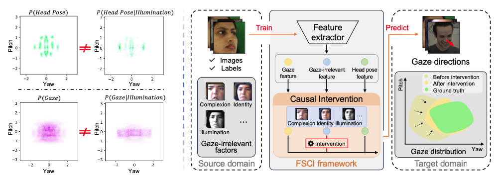
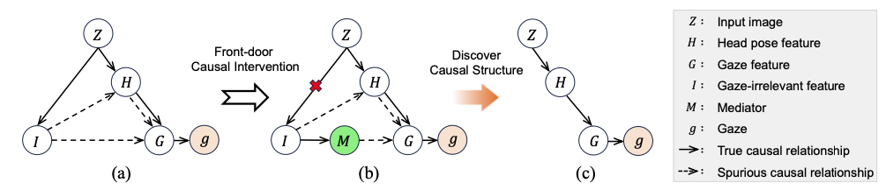
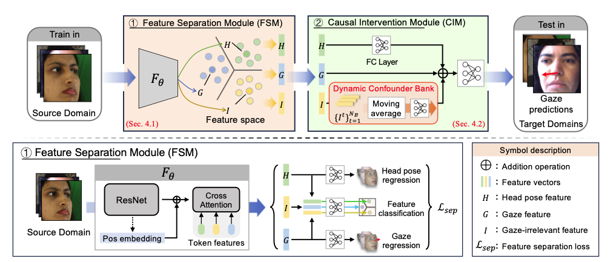
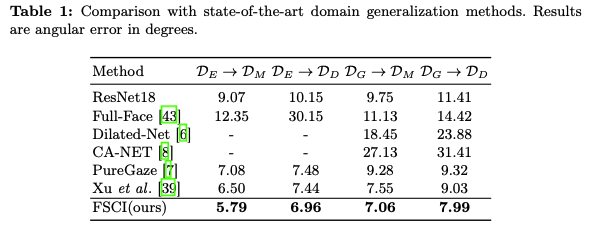

# De-confounded Gaze Estimation

---

### Description




**Picture:** Left: The head pose and gaze distributions in the ETH-XGaze dataset, which intuitively demonstrate the difference between the head pose/gaze distribution and their corresponding conditional distributions. Right: The overall structure of the proposed Feature-Separation-based Causal Intervention (FSCI) framework. the FSCI employs causal intervention to mitigate the influence of gaze-irrelevant feature on the gaze estimation process.



**Picture:** Illustration of our gaze estimation causal graph. After intervening on $Z$, the path $Z → I$ will be blocked.



**Picture:** The overview of the proposed Feature-Separation-based Causal Intervention gaze estimation framework, which consists of two modules: 1) the Feature Separa- tion Module (FSM) and 2) the Causal Intervention Module (CIM). We first employ the FSM to separate the extracted features of the input images into head pose fea- ture, gaze feature, andgaze-irrelevant feature. Then, based on causal intervention, the CIM aggregates the causal effect of gaze-irrelevant feature on gaze direction through the Dynamic Confounder Bank, combined with gaze-related feature to estimate the gaze direction.

---

**Performance:**



### Usage

---

You need to download the data set and preprocess the data set as described in the paper.

#### Python environment

Just a few important python dependencies are listed below. Specific environment dependencies can be referred to the code.

```
python=3.9.18
  - matplotlib
  - numpy
  - pytorch=1.12.0
  - pyg
  - torchvision
  - torchmetrics
  - cudatoolkit=11.3
  - tqdm
  - timm
  - einops
  - transformers
  - tokenizers
  - hydra-core
  - omegaconf
  - palettable
  - git+https://github.com/bes-dev/mean_average_precision.git
  - scipy
```

#### Get Started

If you want to modify the config of the model, you can modify the file: ./config/causality.yaml

> - **Training:** python train.py
> - **Testing:** python test.py


#### Pre-trained model

Due to file size limitation, we only provide model parameters trained on ETH-XGaze.

> - ETH: model_pth/resnet18_ETH.pth


#### Warning

If $error>20$ occurs during testing or training, please check whether the labels of samples in different datasets are consistent.


